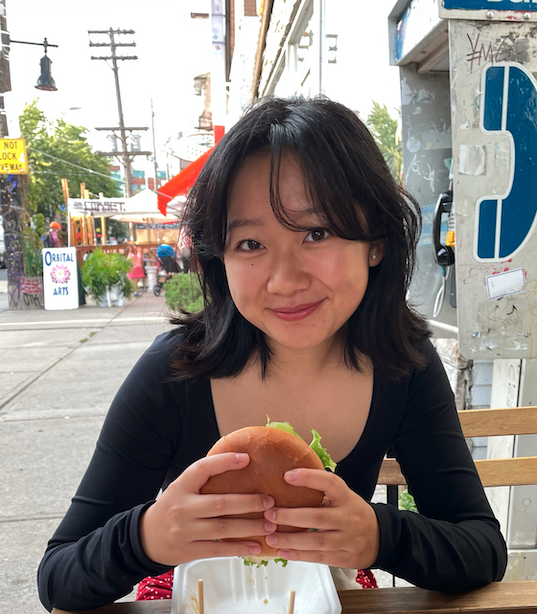

## Hi, I'm Cindy 👋

I'm a fourth-year undergrad studying [Bioinformatics and Computational Biology](https://bcb.csb.utoronto.ca/) at the University of Toronto. I'm interested in developing computational/statistical methods for single-cell data analysis.

Currently, I'm completing my fourth-year project course under the supervision of [Kieran Campbell](https://www.camlab.ca/). My project involves evaluating and predicting scRNA-seq clustering pipeline performance.

In the fall, I will be starting my PhD in Biostatistics at the Johns Hopkins Bloomberg School of Public Health.

## Fun Stuff
I enjoy cooking, reading, and biking around Toronto.\
[Our kombucha recipe](https://docs.google.com/document/d/17-y1aje0G3_frGPQ19gTvn_KQTNQhOXVivYRufM-Fx8/edit#heading=h.qvzb50vfgyzg) (by me and [Jeffrey Im](https://www.math.toronto.edu/jim/), mostly Jeffrey)
